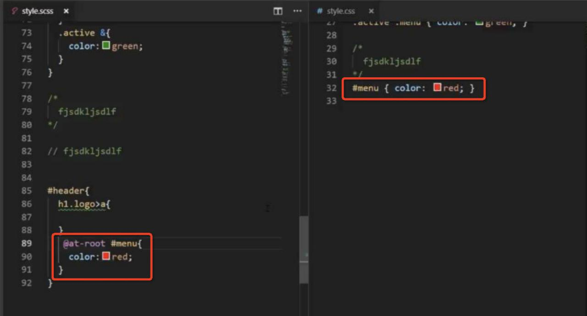
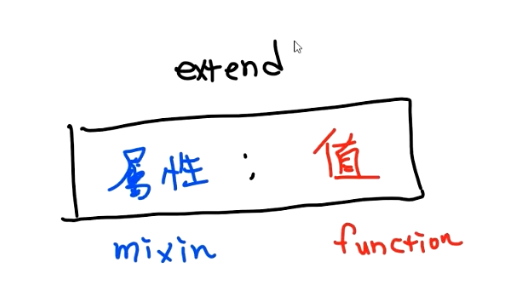

####scss 與 css 差異

1. 巢狀結構樣式設定(結構化設計)
2. 工作區成果區分開(註解、程式碼)

---

####課程重點

- 巢狀結構
  '>' 子代選取器：使用大於箭頭，可以變免後代也被選取到

```
// 這段 code 會導致深層的 li 也會被影響
#header {
 li {
    color: red
 }
}

// 加入 > 就會指定在 #header 的下一層才能擁有這些樣式
#header {
 >li {
    color:blue
 }
}
```

- 上層選取器，清楚 ==「&」== 是誰

```
.button {
    width:100px;
    //&=>.button
    &-primary {
        // 會擴增(展)功能，增加button 的功能性 常用應用:hover :after ....
        // .button-primary { … } <-結果
        background:blue;
    }
    //#{}=>當作參數
    #{&}-warning {
        // .button .button-warning { … } <-結果
        background:yellow;
    }
}
```

- ==重要==:想維持巢狀，但又不想要有階層關係
  @at-root ： 兼顧「區塊控制」需求及「巢狀設定」需求
  - 重點: 1.維持區塊模組 2.控制巢狀層數

```
// 此時的 & 代表 #header #menu
// .active #header #menu { … }
#header {
    #menu {
        .active & {
        }
    }
}

// 加上 @at-root 後 #menu 會被提取到根
// .active #menu { … }
#header {
    @at-root #menu {
        color:red;
        .active & {
            color:blue;
        }
    }
}
```



- scss 註解:
  /\* \*/ 會被流到 css 裡面(css 原本的註解)
  //(雙斜線註解) 只會留在 scss 中,不會產生在 css 檔

  ***

* 變數:
  (套件 SCSS Refactoring=>下載後，清單中功能)

  1. 哪些要當變數? (1)被很多地方重複使用 (2)很常被修改
  2. 變數要怎麼命名 keyPoint:功能性命名
     ex.\$main_bg_color

  - 補充:UI Kit

  3. ==重要:如何使用==
  - Functional naming => 兩筆顏色
    使用方法: \$符號 -> $color:red;

    ```{highlight=4-8}
    $main_bg_color: #000;
    $main_text_color: red;

    // 編譯過後變數自動會被帶入 CSS 中
    .desc {
        color: $main_bg_color;
    }
    // 編譯過 =>.desc { color: red }
    ```

  - Group Naming=> 一組顏色
    map 對照表：對應程式則像 Object 對應 Key: Value
    使用方法: ==mpe-get(\$變數,key)==;

    ```{highlight=6-9}
    $color: (
        primary:#4A89dc,
        warning:#f6bb42
    )

    // 需要使用 map-get 的方式取用
    header {
        background: map-get($color, primary);
    }
    ```

  - Level Naming => 一系列顏色(多筆)
    nth 陣列：與程式的陣列相同，但與程式不同，是從 1 開始計算。
    （如果有加入逗點，就會依據逗點來計算，沒有就以空白來看）
    使用方法: ==nth($變數,num)==;

    ```{highlight=3-6}
    $grayscale: #f5f7fa #ccd1d9 #656d78;

    //$grayscale 是一個list
    .content {
        background: nth($grayscale, 1);
    }
    ```

  - 重要!整合應用:整合 map 與 nth

    ```
    $color: (
        primary:#4A89dc,
        warning:#f6bb42,
        grayscale: #f5f7fa #ccd1d9 656d78
    )
    // nth ( 陣列, index )
    header {
        background: map-get($color, primary);
        color: nth(map-get($color, grayscale), 3);
    }
    ```

    

---

- SCSS 計算(同單位計算or比例變化)
  note:calc 可以跨單位運算，因為 css 是在瀏覽器執行，瀏覽器可以取得相關資訊去換算單位，但稍佔用一點點效能

  ```
  $col: 12 !default;

  .col-12-1 {
      width: (100%)/$col;
  }

  // 變數也擁有作用域，當設定在 {} 內設定，就只會在其中作用
  .col-24-1 {
       $col: 24;
      width: (100%)/$col;
  }

  // 當變數在之後做改變，後面皆會吃到被改變的變數
  $col:24;
  .col-24-2 {
      width: (100%)/$col*2;
  }

  ```
---

#### 繼承(extend) & 混用(mixin) & 函式(function)
  

- extend[樣式集中共用]->把需要設定一模一樣的整理至一起。
  (新手入門大量使用，幾乎用來做基礎設定) 
  ==使用方法: @extand %className==，請參考下面範例。

  1. 繼承的擺放位置（最好要放在檔案最上面）
     - 原因1:比較好改
     - 原因2:樣式必須要在使用前，因為有權重問題
  3. 不能將【外層】的extend放在 Media Query 中使用
  4. <font color="red">使用%來避免佔用 class name</font>
  

  ```scss
  // 當樣式在最前面時，編譯的結果 繼承者 可以覆蓋 被繼承者
  .button {
    //重要的是這個，一定要放在最上面
    text-decoration: none;
    cursor: pointer;
  }

  a.button {
    display: inline-block;
    @extend .button; //放哪都沒差
  }

  a.otherButton {
    @extend .button; //放哪都沒差
    display: inline-block;
  }

  //----%運用(重要重要重要!)----
  %button {
    text-decoration: none;
    cursor: pointer;
  }

  a.button {
    display: inline-block;
    @extend %button;
  }
  //未使用%結果: .button a.button {text-decoration: none;cursor: pointer;}
  //使用%結果: a.button {text-decoration: none;cursor: pointer;}
  ```

- mixin[個別樣式]->設定的「==屬性==」都一樣，值不同。
  ex.我們都有border-radious，你是5px，我是10px  
   ==使用方法: @include name(變數)==，請參考下面範例。
  1. 一定要有【參數】(你丟東西給他，它回一段樣式給你)
  2. 依照參數產生樣式
  3. 請好好用default來設計
  4. 參數不能寫再選取器之中
  5. 不會受到Media Query限制
  6. @content => @mixin大括號裡面的內容
  ```scss
  //請參考style.scss檔案
  //基本寫法
  @mixin name(param: defaultVal){
    ...
  }
  //兩種寫法
  @mixin font($size: 16px, $base: 16px) {
    font-size: $size;
    font-size: ($size/$base) * 1rem;
  }
  @mixin font($size: 16px) {
    $base: 16px !default;
    font-size: $size;
    font-size: ($size/$base) * 1rem;
  }

  //範例
  //此處可以寫參數覆蓋 $base:24px;
  div {
    //此處不能寫參數 $base:24px;
    @include font(24px);
  }
  ```

- function->幫忙做一些複雜計算


#### <font color="red">extend & mixin 差異</font>

extend:管完全一樣，只會產一份。
mixin:個別樣式，會重新再產生一份。

---

#### How 切分檔案
檔案如果有「 _ 」不會再產css

主要分兩種檔案
 - 工具檔(不會產生CSS樣式)，就應該加上"_"
 - 一般檔案(會產生CSS樣式)

css寫法: @import url(./grid.css);(只有一行import)

scss 寫法 @import'./grid.scss';(會直接把檔案內容寫進去)


產CSS的檔案 只能 import 或 使用一次，沒有產css的可以每一頁都import

結構參考

 

---
#### 其他重點

1. CSS 命名偏好-> 使用底線 ex.sub_menu(因為點兩下會整個選起來)
2. 層級不要太多層
3. extra: SASS SCSS 差異?
  - 沒有大括號
  - 沒有分號
  - 空白要小心
4. 不要拿最外層的 "tag" 當第一層 ex. ```<header></headr>、<footer></footer>```、
   (因為tag可以重複使用，每個區塊都有可能用到)
5. 變數盡量不要重複宣告，盡可能重複使用。ex.顏色宣告一次就好，再使用map-get去取
6. em rem?
  - em  會依照層級去繼承
  - rem 永遠根據最外層
7. % 專門繼承的樣式，不會再產class
8. _ 專門載入的檔案

---

#### RWD設定
直接寫在層級之中(如圖)
 - 缺點: media 會變多
 - 優點: 管理觀察上會比較容易
建議:
小型專案 可依照舊往寫法(上面基本樣式，下面變版)
大型專案 可依照上圖管理方式
    
---

---

#### VScode 設定

- zip->免安裝版(==記住==解壓縮後，要開一個 data 資料夾，不然就會是安裝版)
- 套件

  - live server
  - live sass commiler
  - scss refactoring(把一些資料做成變數)

  ```
  {
    "liveSassCompile.settings.formats": [
    // This is Default.
    // {
    //   "format": "expanded",
    //   "extensionName": ".css",
    //   "savePath": null
    // },
    // You can add more. =>專注再選取器(方便工作看)
    {
      "format": "compact",
      "extensionName": ".css",
      "savePath": "/css"
    },
    // More Complex => 壓縮過(上線用)
    // {
    //   "format": "compressed",
    //   "extensionName": ".min.css",
    //   "savePath": "~/../css/"
    // }
    ],
    "liveSassCompile.settings.excludeList": [
      //避開這些檔案成為css ex.bs4不想壓成css
      "**/node_modules/**",
      ".vscode/**"
    ],
    //generateMap=>會產生map檔案，會告訴你產在scss哪裡
    "liveSassCompile.settings.generateMap": false,
    "liveSassCompile.settings.autoprefix": [
      "> 1%",
      "last 2 versions"
    ]
  }
  ```

  - format 格式設定(固定用黃底的):
    - expanded 手打樣式
    - ==compact== 專注於選取器(行數會減少，也可以看層階有幾層)
    - nested 可以清楚看到巢狀結構
    - ==compressed== 可將檔案壓縮成一行(上線用)
  - "liveSassCompile.settings.generateMap"=>改成 true
    console->setting->Enable CSS source maps 打勾
